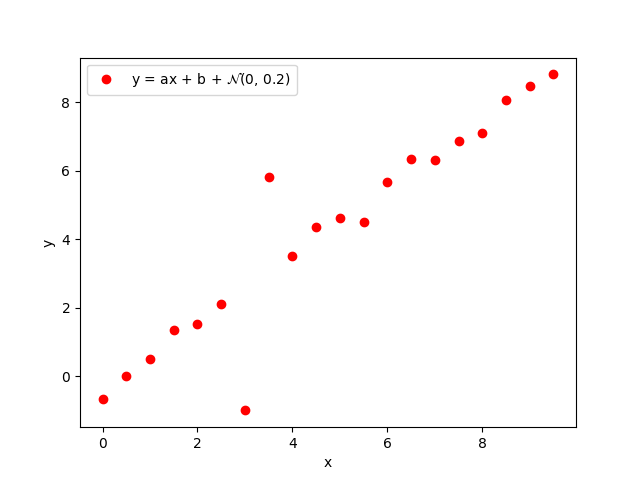

# HW 1 

### Configuration
Sampling = 20

A = 1, b = -0.5

X_min = -5.0 and X_min = 5.0

## Problem 1

The model for Standard least squares method could be written as
<p align="center">
<a href="https://www.codecogs.com/eqnedit.php?latex=m_{\text{LS}}&space;=&space;(A^TA)^{-1}A^Td" target="_blank"></a>
</p>

The model for Weight least squares method could be written as
<p align="center">
<a href="https://www.codecogs.com/eqnedit.php?latex=m_{\text{LS}}&space;=&space;(A_w^TA_w)^{-1}A_w^Td_w" target="_blank"></a>
</p>
where

<p align="center">
<a href="https://www.codecogs.com/eqnedit.php?latex=W&space;\equiv&space;\text{diag}(1/\sigma_1,&space;...,&space;1/\sigma_N)" target="_blank"></a>, 
<a href="https://www.codecogs.com/eqnedit.php?latex=A_W&space;=&space;WA" target="_blank"></a>,
<a href="https://www.codecogs.com/eqnedit.php?latex=d_W&space;=&space;Wd" target="_blank"></a>
</p>

But for this case, we fix 

#### result

<p align="center">
    
    <br>
    <em>Distribution of sampling </em>
</p>

```bash
Standard least squares method
Parameter a = 1.0170805817593336, b = -0.5028239714281391
Weight least squares method
Parameter a = 1.017080581759334, b = -0.5028239714281391
```
Model parameters that we get from both method is the same in this case.

## Problem 2
#### result

<p align="center">
    
    <br>
    <em>Distribution of sampling </em>
</p>

```bash
Standard least squares method
Parameter a = 1.002113715740859, b = -0.5007968746258271
Weight least squares method
Parameter a = 1.0048940649993203, b = -0.5054369892491586
```
Regarding to the result, parameters that we got are very similar and difference only in third order.

## Problem 3
### Outlier generator
Picking up 2 of those sampling and add by 3 where the direction is also randomed for both positive and negative.
### L1 Regression
* Notation for a relations
    * <a href="https://www.codecogs.com/eqnedit.php?latex=R_{ki}&space;\leftarrow&space;\text{diag}<(|d-Am_{ki}|)^{-1}>" target="_blank">" title="R_{ki} \leftarrow \text{diag}<(|d-Am_{ki}|)^{-1}>" /></a>
    * <a href="https://www.codecogs.com/eqnedit.php?latex=m_{kf}&space;\leftarrow&space;(A^TR_{ki}A)^{-1}A^TR_{ki}d" target="_blank"></a>
    * <a href="https://www.codecogs.com/eqnedit.php?latex=\epsilon_{\text{now}}&space;\leftarrow&space;\frac{||&space;m_{kf}&space;-&space;m_{ki}&space;||}{1&plus;||m_{kf}||}" target="_blank"></a>

#### Pesudocode
```
func get_model_by_l1r(A, d, m_0, epsilon)
    m_ki = m_0
    while true do
        R_ki <- get_R(A, d, m_ki)
        m_kf <- get_m(A, d, R_ki)
        e_now <- get_e(m_ki, m_kf)
        if e_now < epsilon then
            break
        endif
        m_ki <- m_kf
    return m_kf
end func
```

#### result

<p align="center">
    
    <br>
    <em>Distribution of sampling </em>
</p>

<p align="center">
    
    <br>
    <em>Epsilon versus iteration #</em>
</p>

<p align="center">
    
    <br>
    <em>Epsilon versus iteration # in log scale</em>
</p>

```
Standard least squares method
Parameter a = 0.9970732374883036, b = -0.5190735576419936
L1 Regression method
Epsilon_now = 7.49886459001097e-13
Parameter a = 0.9934621610880363, b = -0.4686710926294424
```
Model parameters are quite different but even in the first order of magnitude and the epsilon is also decaying over the iteration with a small fluctuation.