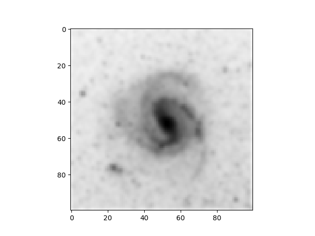

# HW 2: Galaxy deblur

d is the blured image of the galaxy via the transformation

where the kernel is given by

Consider the discrete integration then

Since governing equation is

The Kernel will be a tensor rank 4 where it could leading to a complicated operation. Then we need to convert the indices from matrix to vector and the kernel will become a tensor rank 2 as

The original image could be calculated by using relation

which A is equivalent to kernel (K) in this case.

#### Result

    
     
    <em>Blured Galaxy</em>

    
     
    <em>Deblured Galaxy</em>

