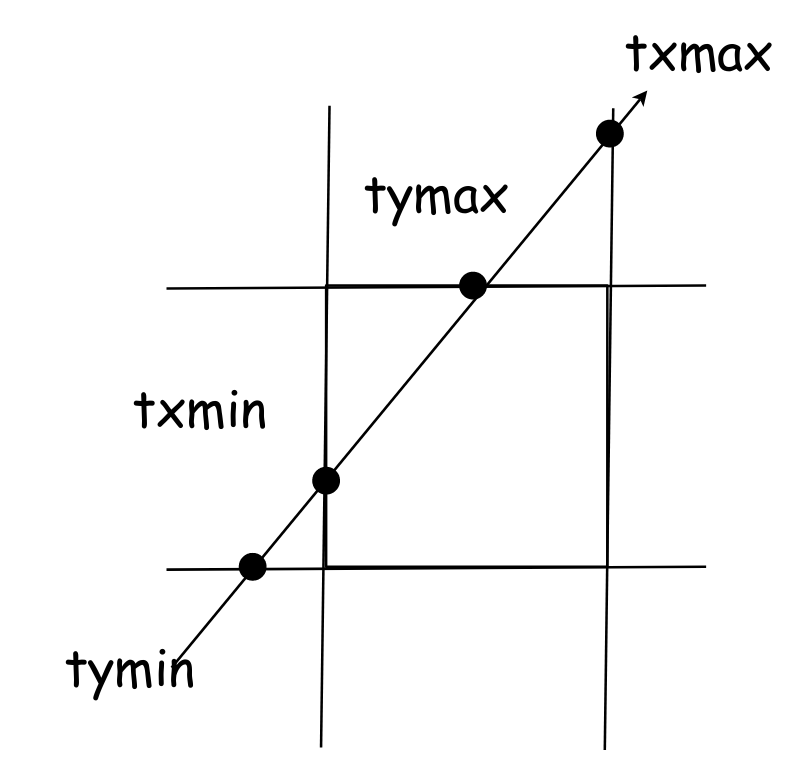
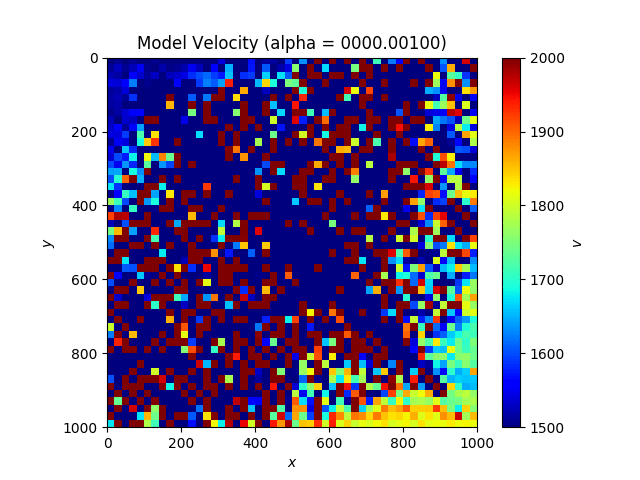
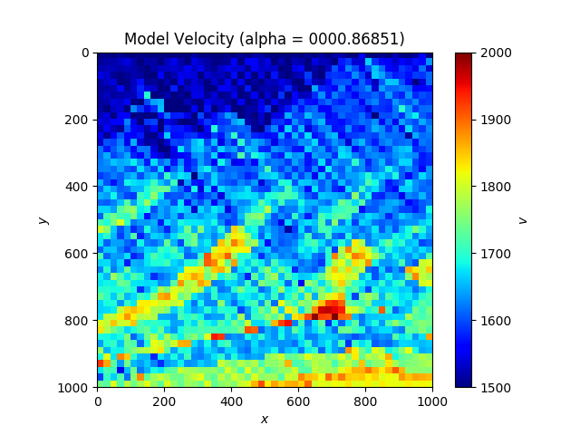
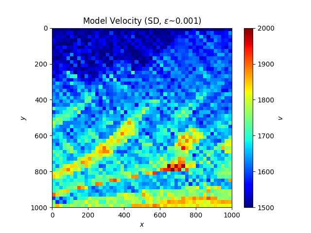
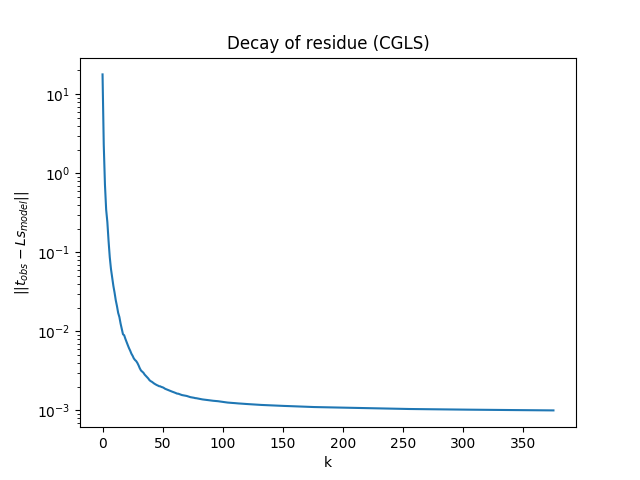

# HW 3

## Problem 1: Tomography

<p align="center">
    
    <br>
    <em>Real velocity map of the stone layer</em>
</p>

### Finding a ray's path length 

* Equation of relation of path length of each source-receiver pair

<p align="center">
<a href="https://www.codecogs.com/eqnedit.php?latex=\vec{p}(t)&space;=&space;\vec{p}_{\text{source}}&space;&plus;&space;t\vec{d}" target="_blank"></a>
</p>

where

<p align="center">
<a href="https://www.codecogs.com/eqnedit.php?latex=\vec{d}&space;=&space;\frac{\vec{p}_{\text{receiver}}&space;-&space;\vec{p}_{\text{source}}}{|\vec{p}_{\text{receiver}}&space;-&space;\vec{p}_{\text{source}}|}" target="_blank"></a>
</p>

* Criteria for visible region
    * Selecting cell that cross the line of sight could be calculated by computing the angle of each corners related to the origin
    * Find the angle of vector (d) to check visible angle along the line sight
    ```python
    if d_angle >= min(angles) and d_angle <= max(angles):
    ```

* Finding four guiding possible crosspoint

<p align="center">
    
    <br>
    <em>Possible cross points of one grid that intersect the line of sight</em>
    <br>
    Image taken from: http://web.cse.ohio-state.edu/~shen.94/681/Site/Slides_files/basic_algo.pdf
</p>

The ray length of one grid would be the path different length of second and third orderly

```python
s_map[g_i] = t[2] - t[1]
```

Full source code could be found [here](pb1/ray.py)

### 1.1 Least Square with Tikhonov Regularization

<p align="center">
    
    <br>
    <em>Fix source and shifting receiver along y-axis</em>
</p>

<p align="center">
    
    <br>
    <em>Measured wave velocity from various alpha</em>
</p>

<p align="center">
    
    
    <br>
    <em>L-Curve of getting proper alpha from origin and shifted reference</em>
</p>

#### Compare two selected alphas with the real velocity map

<p align="center">
    
    
    
    <br>
    <em>Real velocity map of the stone layer</em>
</p>

### 1.2 Applying linear SD and CG inverse problem

#### SD

<p align="center">
    
    <br>
    <em>Measured wave velocity from SD</em>
</p>

<p align="center">
    
    <br>
    <em>Measured wave velocity from SD</em>
</p>

#### CGLS

For linear-CG for symmetric definite systems, there was divergence during the iteration. Then I decided to use CGLS technique instead and the result is well-performed.

<p align="center">
    
    <br>
    <em>Measured wave velocity from CGLS</em>
</p>

<p align="center">
    
    <br>
    <em>Measured wave velocity from CGLS</em>
</p>


## Problem 2: Optimize Rosenblock function

* Rosenblock function is given by

<p align="center">
<a href="https://www.codecogs.com/eqnedit.php?latex=f(x_1,&space;x_2)&space;=&space;(1-x_1)^2&space;&plus;&space;100(x_2-x_1^2)^2" target="_blank"></a>
</p>

<p align="center">
    
    <br>
    <em>Rosenblock potential</em>
</p>


### 2.1 Fix step-length

The system started diverge when it approching to the purple region and because the gradient vector in that region yield a very drasticly drag our point outward the optimized point. Instant solution is simply normalize the gradient vector and the problem is solved slowly with a very tiny gradient vector in order of hundred thousand where SD converge faster than CG.

<p align="center">
    
    
    <br>
    <em>SD</em>
</p>

<p align="center">
    
    
    <br>
    <em>CG</em>
</p>

### 2.2 Backtracking
This method is very robust where the proper alpha is not too high which fit very well with this problem. CG converge faster than SD in two orders of magnitude.

<p align="center">
    
    
    <br>
    <em>SD</em>
</p>

<p align="center">
    
    
    <br>
    <em>CG</em>
</p>

### 2.3 Quadratic/Cubic

Since the alpha value is very small in the quadratic interpolation and when it's satisfied, it makes the iteration process very slow then it takes around 2 millions iterations

<p align="center">
    
    
    <br>
    <em>SD</em>
</p>

For the case of CG, finding alpha in quadratic interpolation cause the problem of divergence due to alpha value is very slow which I did mention in the previous paragraph. In order to reduce this problem, we could intuitively fix it by making the condition where too small alpha would not be pass even it satify sufficient decrease condition but we rather throw it into cubic interpolation before checking the condition and then it start converge in order of hundred iteration which is incredibly fast compare to the previous one.

<p align="center">
    
    
    <br>
    <em>CG</em>
</p>

### 2.4 Newton

I would say that this method is purely **magic trick!** The iteration never more than 5 times even I change the initial point to a very far place for various quadrant and it almost instantly converge to the optimal point. Nevertheless, this method require the hessian (Laplacian-ish) matrix and the inverse of it which could be an overwhelming calculation when we had large dimension size of x.

<p align="center">
    
    
    <br>
    <em>Newton</em>
</p>

