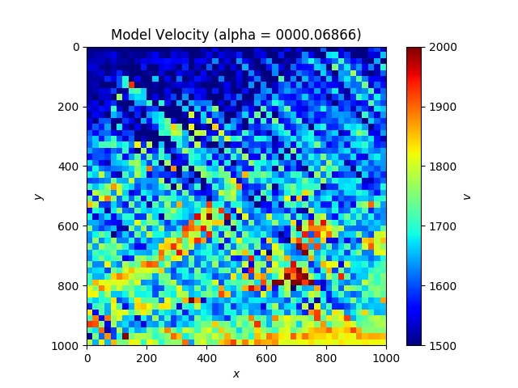
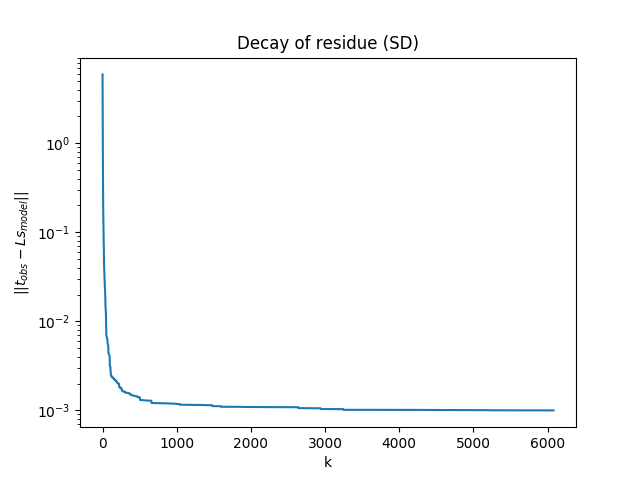

# HW 3

## Problem 1: Tomography

    
     
    <em>Real velocity map of the stone layer</em>

### Finding a ray's path length

* pic with reference
* eq

    
     
    <em>Fix source and shifting receiver along y-axis</em>

    
     
    <em>Measured wave velocity from various alpha</em>

    
    
     
    <em>L-Curve of getting proper alpha from origin and shifted reference</em>

#### Corner compare

    
    
    
     
    <em>Real velocity map of the stone layer</em>

### 1.1 Least Square with Tikhonov Regularization

### 1.2 Applying linear SD and CG inverse problem

#### SD

    
     
    <em>Measured wave velocity from SD</em>

    
     
    <em>Measured wave velocity from SD</em>

#### CGLS

since bla

    
     
    <em>Measured wave velocity from CGLS</em>

    
     
    <em>Measured wave velocity from CGLS</em>

## Problem 2: Optimize Rosenblock function

* Rosenblock

### 2.1 Fix step-length

    
    
     
    <em>SD</em>

    
    
     
    <em>CG</em>

### 2.2 Backtracking

    
    
     
    <em>SD</em>

    
    
     
    <em>CG</em>

### 2.3 Quadratic/Cubic

    
    
     
    <em>SD</em>

* report cg too small alpha

    
    
     
    <em>CG</em>

### 2.4 Newton

    
    
     
    <em>Newton</em>

