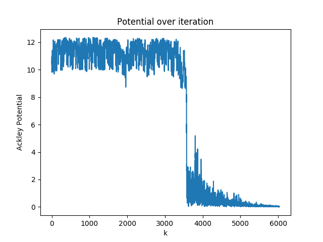

# HW 4

## Solving traveling saleman problem by using Simulated Annealing (SA) 
Optimize walking distance all over the region by using Simulated Annealing.

* Simulated Annealing
    * Initial random state and temperature
    * Disturb the state and calculate the difference potential compare to the previous state to compute the new accept state
        * If the new potential is lower then accept
        * Else calculate accepted probability of the new state regarding to Boltzmann distribution
    * Repeat second step until the accept state reaching the cutoff that we difined with a temperature decay factor for the new iteration


### Pb1 Circle
```python
HOUSE = 30
```

There are two anneling schedules that I perform an optimization

#### 1) Exponential cooling scheme (ECS)

where the the governing equation for temperature could be represent as

T_new <- T_old * T_DECAY

Hyper parameters
```python
T = 30000
T_DECAY = 0.95
T_STOP = 1e-6
N_ACCEPTED_MAX = 30
```

<p align="center">
    
    <br>
    <em>Initial path</em>
</p>

<p align="center">
    
    <br>
    <em>Sum distance over iterations</em>
</p>

<p align="center">
    
    <br>
    <em>Optimized path</em>
</p>

Varying T_DECAY to observe the behavior of the system

<p align="center">
    
    
    <br>
    <em>DECAY_RATE = 0.85</em>
</p>

<p align="center">
    
    
    <br>
    <em>DECAY_RATE = 0.75</em>
</p>

Since the minimum condition of DECAY_RATE could not be lower than 0.85 then 0.75 is the problem in principle but in practice it yield the same of 0.85 in this case. There are only on path that system could not solve if we set DECAY lower than 0.9.

#### 2) Linear cooling scheme (LCS)

where the the governing equation for temperature could be represent as

T_new <- T_old - T_DECAY

Hyper parameters
```python
T = 300.0
T_DECAY = 0.01
T_STOP = 0.02
N_ACCEPTED_MAX = 30
```

<p align="center">
    
    <br>
    <em>Sum distance over iterations</em>
</p>

<p align="center">
    
    <br>
    <em>Optimized path</em>
</p>

It is obviously to see that the ECS converge much more faster than the linear cooling because the faster cooling down will make the system stable faster than the slower one as long as a cooling scheme satisfy convergence condition.

### Pb2 Uniform random location
```python
HOUSE = 100
```
 
<p align="center">
    
    <br>
    <em>Initial path</em>
</p>

<p align="center">
    
    <br>
    <em>Sum distance over iterations</em>
</p>

<p align="center">
    
    <br>
    <em>Optimized path</em>
</p>

## Minimize Ackley Function

<p align="center">
    
</p>

### Pb3 Simulated Annealing
<p align="center">
    
    <br>
    <em>Potential overiteration</em>
</p>

<p align="center">
    
    <br>
    <em>Particle positions over iterations</em>
</p>

### Pb4 Particle Swam

* Define reward function as the negative sign of Ackley function to be a fitness value
* Suppose the iteration k each particle hold it own fitness balue b_i then the local best fitness is max(b_i) and the global one need to be consider as
<p align="center">
<a href="https://www.codecogs.com/eqnedit.php?latex=B&space;=&space;\text{argmax}(b^i_k)" target="_blank"></a>
</p>
where the position of the best local and global particle is also neccesary to use to calculate the velocity over iteration process

* Governing equation for updating the new velocity
<p align="center">
<a href="https://www.codecogs.com/eqnedit.php?latex=v^i_{k&plus;1}&space;=&space;\omega&space;v^i_k&space;&plus;&space;c^br^b_k[x^i_{k,*local}-x^i_k]&space;&plus;&space;c^Br^B_k[x^i_{k,*global}-x^i_k]" target="_blank"></a>
</p>

<p align="center">
<a href="https://www.codecogs.com/eqnedit.php?latex=x^i_{k&plus;1}&space;=&space;x^i_k&space;&plus;&space;v^i_{k&plus;1}" target="_blank"></a>
</p>

where
* omega is the inertia constant of to weight the old velocity
* c is the factor of the dragging force of the local and global best fitness
* r is the uniform random value from zero to unity

In my case
```python
N_PARTICLE = 32
OMEGA = 0.7
C_b = 2.0
C_B = 2.0
STOP_VAL = 1e-4
```

<p align="center">
    
    <br>
    <em>Initial position</em>
</p>

<p align="center">
    
    <br>
    <em>Reward over iterations</em>
</p>

The convention for stable state of mine is to assume that the best local reward and mean local rewards has similar value or ideally exactly the same state which means that every particle agree to stop at the global position that located in a set of the initial states.

<p align="center">
    
    <br>
    <em>Particle positions over iterations</em>
</p>