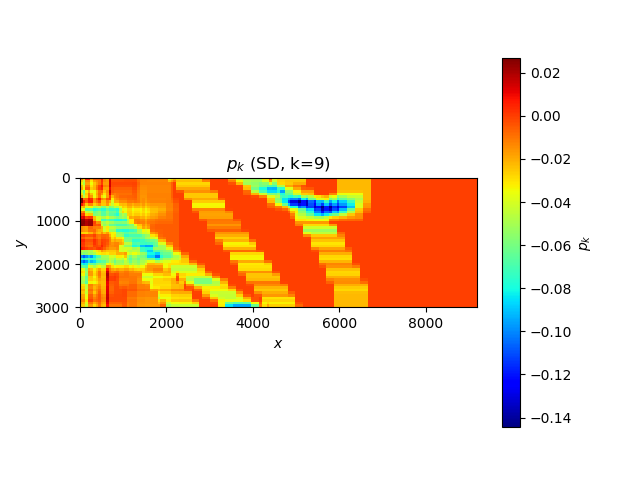
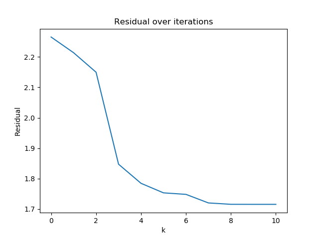
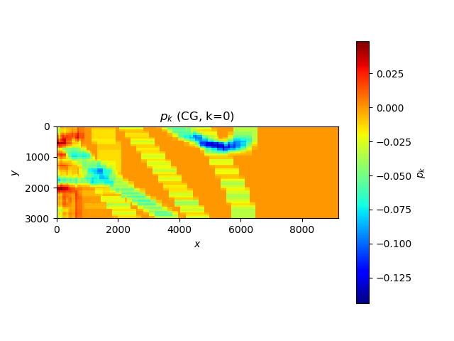
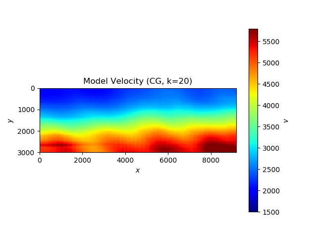
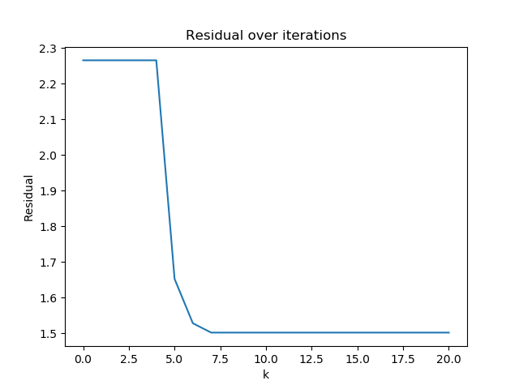
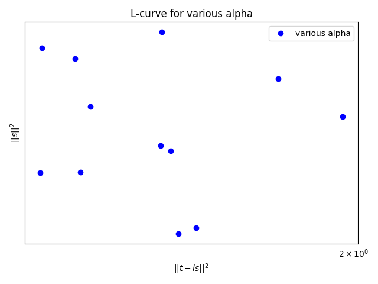

# HW 5: Curved Ray Traveltimg Tomography

## Fast Sweeping Algorithm
Let

### Discretization
Since

Consider discrete form with Godunov upwind different scheme

Where

### Gauss-Seidei iterations
The new travel time could be updated via

<a href="https://www.codecogs.com/eqnedit.php?latex=\inline&space;\begin{align*}&space;\bar{T}_{ij}=&space;\begin{cases}&space;\min(T^h_{x,\text{min}},&space;T^h_{y,\text{min}})&space;&plus;&space;s_{ij}h\&space;&:\&space;|T^h_{x,\text{min}}-&space;T^h_{y,\text{min}}|&space;\geq&space;s_{ij}h&space;\\&space;\frac{T^h_{x,\text{min}}&plus;&space;T^h_{y,\text{min}}&plus;\sqrt{2s^2_{ij}h^2-(T^h_{x,\text{min}}-&space;T^h_{y,\text{min}})^2}}{2}&space;\&space;&:\&space;|T^h_{x,\text{min}}-&space;T^h_{y,\text{min}}|&space;<&space;s_{ij}h&space;\end{cases}&space;\end{align*}" target="_blank"></a>

Sweep the travel time 2D field with for four quadrant of the field and update the new travel time via

The amount of iteration could be either determined from a given maximum number or the while condiiton where a variation between the previous and the current state is so small.

### Example of Travel Time Field from a single source

    

    

    

[Source code](utility.py) of the travel time.

### Ray path
A ray path be calculated from the travel time field from a source and a given regarded receiver position. The process is simply start with the point of receiver on the travel time field and compute a gradient to update the previous position of the ray until it reach to the source.

    
    
     

[Source code](ray.py) of a curved ray tracing.

### Real Velocity Map 

    
     

### Initial Velocity Model

    
     
    <em>Initial Velocity Model</em>

    
    
     
    <em>An example of the one pair of source-receiver from an initial velocity model</em>

The ray legnths in each pair of source-receiver could be parallelize into multiple threads that could easily implement with the built-in Python's multiprocessing to reduce the calculation time in each ray tracing that could taking the .

Note: All of the configuration is in this [file](settings.py).

## Pb 1 Steepest descent method with a back-tracking line search ([Source](pb1/sd.py))

    
    
     
    <em>The blurred gradient fields after applied a uniform filter kernel size of (10, 40)</em>

    
    
     
    <em>Results from hyper-parameters: alpha0=0.0001 and alpha_decay=0.5</em>

SD method with backtracing step length yield a reasonable result where we could see a remarkable band around x = 6000 and y ~ 8000 which agree to the real velocity map.

## Pb 2 Nonlinear conjugate gradient method with the Wolfe conditions and quadratic/cubic interpolation for the line search ([Source](pb2/cg.py))

    
    
     
    <em>The blurred gradient fields after applied a uniform filter kernel size of (10, 40)</em>

    
    

The iteration that CG method with quad/cube interpolation step length reach to the minimum point much faster than SD method with backtracing. Nevertheless, a gradient field looks similar for both methods in an early iteration except for the latter iteration where it almost plateau in the loss figure.

## Pb 3 Marquardt-Levenberg method

The line search direction from Newton's method are governed by

The method of Gauss-Newton line search direction in non-linear least square could also be regularized by adding the constrain lambda in the hessian approximation term as

The lambda factor is essentially one of the hyper-parameters that has to tune to the proper value.
One way to determine the proper value lambda is to try various quantities and visual the L-Curve which the bottom is the proper hyper-parameter where it does not make the model overfitting the problem and vice versa.

An overwhelming of memory allocation occurs in this problem. The easiest way to fix the problem without any modified the algorithm code is to reduce the size of velocity field as in the [settings](settings.py) file.

### Results from various alpha
Splitting the alpha parameters in the log-scale from xxx to xxx. The amount of trial alpha is 12. 

    
    

    
    

    
    

    
    

    
    

### L-Curve

    
    
     
    <em>L-Curve from various trial of alpha with log and linear scale</em>

